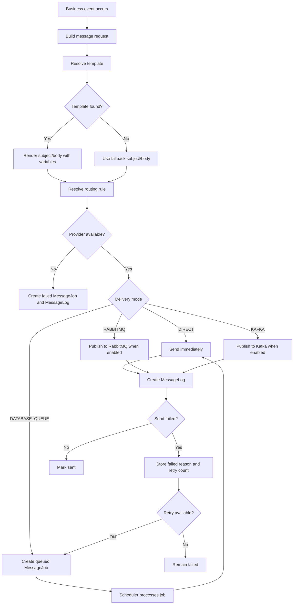

# Message And Communication Module Workflow

This file tracks the phased implementation of a centralized communication module for Email, SMS, WhatsApp, Push, and In-App notifications.

## Current Goal

Create one admin-managed communication module that can:

1. Manage message templates by event, channel, language, and status.
2. Manage channel providers and credentials.
3. Route messages by event, channel, delivery mode, provider, and volume.
4. Queue, retry, and log message delivery attempts.
5. Store in-app notifications.
6. Integrate safely with customer, vendor, order, payment, shipping, promotion, wallet, and notification flows without breaking the business transaction when delivery fails.

## Status Legend

- `Done`: already exists or completed in this workflow
- `In Progress`: currently being developed
- `Pending`: not started
- `Blocked`: waiting for decision or dependency
- `Deferred`: intentionally left for a later phase

## Existing Code Found During Initial Inspection

Status: `Done`

Communication-adjacent code existed during initial inspection, but the centralized module is now being built fresh and does not depend on those old services:

- `main/java/com/ecommerce/app/globalServices/SmsService.java`
  - Old SMS service path.
- `main/java/com/ecommerce/app/globalServices/EmailServices.java`
  - Old email service path.
- `main/java/com/ecommerce/app/module/ReferralRewards/services/PromotionNotificationService.java`
  - Old promotion in-app service path.
- `main/java/com/ecommerce/app/module/ReferralRewards/model/CustomerNotifications.java`
  - Old promotion-specific in-app notification/log entity.
- `main/java/com/ecommerce/app/module/ReferralRewards/repository/CustomerNotifications.java`
  - Old promotion-specific notification repository.
- Admin CRUD patterns exist in shipping, commission, ads, settings, and referral reward modules.
- Shared admin layout exists through `main/resources/templates/admin-layout.html`.
- Admin sidebar is `main/resources/templates/admin-nav-left.html`.

Implementation note:

- Do not depend on old global/referral communication services.
- The centralized `Notification` entity is new and stored in `communication_notifications`.
- Any old promotion notifications can be migrated or bridged later if required, but new communication work uses the fresh module.

## Phase 1: Module Foundation

Status: `Done`

Create package:

- `main/java/com/ecommerce/app/module/communication`

Created DTO/config files:

- `main/java/com/ecommerce/app/module/communication/dto/CommunicationSendResult.java` - `Done`
- `main/java/com/ecommerce/app/module/communication/dto/MessageDispatchRequest.java` - `Done`
- `main/java/com/ecommerce/app/module/communication/dto/RenderedMessage.java` - `Done`
- `main/java/com/ecommerce/app/module/communication/config/CommunicationSchedulingConfiguration.java` - `Done`

Create enum files:

- `MessageChannel`
  - `EMAIL`
  - `SMS`
  - `WHATSAPP`
  - `PUSH`
  - `IN_APP`
- `MessageEventType`
  - `CUSTOMER_REGISTERED`
  - `CUSTOMER_LOGIN_OTP`
  - `PASSWORD_RESET_REQUEST`
  - `ORDER_PLACED`
  - `ORDER_CONFIRMED`
  - `ORDER_PROCESSING`
  - `ORDER_PACKED`
  - `ORDER_SHIPPED`
  - `ORDER_OUT_FOR_DELIVERY`
  - `ORDER_DELIVERED`
  - `ORDER_CANCELLED`
  - `PAYMENT_SUCCESS`
  - `PAYMENT_FAILED`
  - `PAYMENT_REFUNDED`
  - `SHIPMENT_CREATED`
  - `TRACKING_NUMBER_ADDED`
  - `SHIPMENT_DELAYED`
  - `DELIVERY_FAILED`
  - `RETURN_REQUESTED`
  - `RETURN_APPROVED`
  - `RETURN_REJECTED`
  - `REFUND_INITIATED`
  - `REFUND_COMPLETED`
  - `VENDOR_REGISTERED`
  - `VENDOR_APPROVED`
  - `NEW_ORDER_ASSIGNED_TO_VENDOR`
  - `LOW_STOCK_ALERT_VENDOR`
  - `VENDOR_PAYOUT_CREATED`
  - `ABANDONED_CART`
  - `COUPON_CREATED`
  - `FLASH_SALE_STARTED`
  - `CASHBACK_EARNED`
  - `REWARD_POINTS_EARNED`
  - `FRAUD_FLAG_CREATED`
  - `SYSTEM_ERROR_ALERT`
- `DeliveryMode`
  - `DIRECT`
  - `DATABASE_QUEUE`
  - `RABBITMQ`
  - `KAFKA`
- `MessageStatus`
  - `DRAFT`
  - `ACTIVE`
  - `INACTIVE`
  - `QUEUED`
  - `PROCESSING`
  - `SENT`
  - `FAILED`
  - `CANCELLED`
- `ProviderType`
  - `SMTP`
  - `SMS_GATEWAY`
  - `WHATSAPP_API`
  - `FCM`
  - `INTERNAL`
  - `WEBHOOK`

Phase 1 enum files are complete.

## Phase 2: Entities And Repositories

Status: `Done`

Create entities:

- `MessageTemplate`
  - eventType
  - channel
  - subject
  - body
  - language
  - status
  - variables/help text for placeholders such as `{{customerName}}`, `{{orderNumber}}`, `{{orderTotal}}`, `{{trackingNumber}}`
- `MessageProvider`
  - providerName
  - channel
  - providerType
  - apiKey
  - apiSecret
  - senderId
  - baseUrl
  - status
  - priority
- `MessageRoutingRule`
  - eventType
  - channel
  - deliveryMode
  - provider
  - minVolume
  - maxVolume
  - active
- `MessageJob`
  - eventType
  - channel
  - recipient
  - subject
  - body
  - payloadJson
  - status
  - retryCount
  - scheduledAt
  - sentAt
  - failedReason
- `MessageLog`
  - eventType
  - channel
  - recipient
  - provider
  - status
  - responseCode
  - responseMessage
  - sentAt
- `Notification`
  - user
  - eventType
  - channel
  - title
  - message
  - payloadJson
  - seen
  - seenAt
  - createdAt

Create repositories:

- `MessageTemplateRepository`
- `MessageProviderRepository`
- `MessageRoutingRuleRepository`
- `MessageJobRepository`
- `MessageLogRepository`
- `NotificationRepository`
- `CommunicationSettingRepository`

Phase 2 backend entity and repository files are complete.

Implementation notes:

- Use `@Enumerated(EnumType.STRING)` for enum fields.
- Keep secrets nullable and avoid printing `apiKey` or `apiSecret` in logs.
- Add optimistic locking where admin-managed records are editable.

## Phase 3: Core Services

Status: `Done`

Create services:

- `MessageTemplateService`
  - Find active template by event, channel, language.
  - Render variables safely.
  - Use fallback subject/body when template is missing.
- `MessageProviderService`
  - Select active provider by channel and priority.
  - Return missing provider result without throwing into business flow.
- `MessageRoutingService`
  - Choose delivery mode by event, channel, and volume.
  - Rule match order: active rule, eventType, channel, volume range, provider priority.
  - Default mode: `DIRECT` for small volume, `DATABASE_QUEUE` for medium volume.
  - `RABBITMQ` and `KAFKA` remain configurable but disabled until infrastructure exists.
- `MessageDispatchService`
  - Public safe entry point for other modules.
  - Catches delivery exceptions and records failed job/log.
  - Never breaks order/payment/shipping transaction.
- `MessageJobService`
  - Queue jobs.
  - Pick retryable failed jobs.
  - Update retry count, sent time, and failed reason.
- `MessageLogService`
  - Store every send attempt.
- `NotificationService`
  - Store and read in-app notifications.

Phase 3 core services are complete:

- `CommunicationSettingsService`
- `MessageTemplateService`
- `MessageProviderService`
- `MessageRoutingService`
- `MessageDispatchService`
- `MessageJobService`
- `MessageLogService`
- `NotificationService`

## Phase 4: Channel Adapters

Status: `Done`

Create adapter interface:

- `MessageChannelSender`
  - supports channel
  - send request
  - return response code/message/status

Create adapter implementations:

- `EmailMessageSender`
  - Uses `JavaMailSender` directly when configured. `Done`
- `SmsMessageSender`
  - Fresh provider-backed HTTP adapter using provider `baseUrl`. `Done`
- `WhatsAppMessageSender`
  - Fresh provider-backed HTTP adapter using provider `baseUrl`. `Done`
- `PushMessageSender`
  - Fresh provider-backed HTTP adapter using provider `baseUrl`. `Done`
- `InAppMessageSender`
  - Persists centralized `Notification`. `Done`
- `ProviderHttpClient`
  - Shared timeout-safe HTTP sender for SMS, WhatsApp, and Push providers. `Done`

Implementation notes:

- Missing or inactive provider returns `FAILED`.
- Channel failures create `MessageLog`.
- Do not throw failures back to order/payment/shipping callers.

## Phase 5: Retry And Queue Processing

Status: `Done`

Create scheduled processor:

- `MessageJobRetryScheduler`
  - Find `QUEUED` or retryable `FAILED` jobs.
  - Respect configurable max retry count.
  - Increment retry count.
  - Store failed reason.
  - Mark as `SENT` or `FAILED`.

Create configuration:

- `CommunicationSettings`
  - default language
  - direct volume threshold
  - queue volume threshold
  - max retry count
  - retry delay minutes
  - enable/disable scheduler

Phase 5 backend retry and scheduler files are complete:

- `MessageJobRetryScheduler`
- `CommunicationSchedulingConfiguration`
- `CommunicationSetting`
- `CommunicationSettingsService`

## Phase 6: Admin Pages

Status: `Done`

Create admin controllers and Thymeleaf pages:

- Message Template CRUD
  - `/admin/communication/templates`
- Message Provider CRUD
  - `/admin/communication/providers`
- Routing Rule CRUD
  - `/admin/communication/routing-rules`
- Message Job List
  - `/admin/communication/jobs`
- Message Log List
  - `/admin/communication/logs`
- Communication Settings
  - `/admin/communication/settings`

Update:

- `main/resources/templates/admin-nav-left.html`
  - Communication menu group added.

Implementation notes:

- Follow existing `admin-layout`.
- Use Bootstrap 5 tables/forms.
- Add filters for eventType, channel, status, provider, and date where useful.
- Mask provider secrets in UI.

Phase 6 admin files are complete:

- `CommunicationAdminController`
- `templates.html`
- `template-form.html`
- `providers.html`
- `provider-form.html`
- `routing-rules.html`
- `routing-rule-form.html`
- `jobs.html`
- `logs.html`
- `settings.html`
- `fragments.html`

## Phase 7: Integration Events

Status: `In Progress`

Integrate only after the module foundation is stable:

- Customer registration
  - `CUSTOMER_REGISTERED`
  - `CUSTOMER_LOGIN_OTP`
  - `PASSWORD_RESET_REQUEST`
- Order lifecycle
  - `ORDER_PLACED`
  - `ORDER_CONFIRMED`
  - `ORDER_PROCESSING`
  - `ORDER_PACKED`
  - `ORDER_SHIPPED`
  - `ORDER_OUT_FOR_DELIVERY`
  - `ORDER_DELIVERED`
  - `ORDER_CANCELLED`
- Payment lifecycle
  - `PAYMENT_SUCCESS`
  - `PAYMENT_FAILED`
  - `PAYMENT_REFUNDED`
- Shipping lifecycle
  - `SHIPMENT_CREATED`
  - `TRACKING_NUMBER_ADDED`
  - `SHIPMENT_DELAYED`
  - `DELIVERY_FAILED`
- Return/refund lifecycle
  - `RETURN_REQUESTED`
  - `RETURN_APPROVED`
  - `RETURN_REJECTED`
  - `REFUND_INITIATED`
  - `REFUND_COMPLETED`
- Vendor lifecycle
  - `VENDOR_REGISTERED`
  - `VENDOR_APPROVED`
  - `NEW_ORDER_ASSIGNED_TO_VENDOR`
  - `LOW_STOCK_ALERT_VENDOR`
  - `VENDOR_PAYOUT_CREATED`
- Promotion and wallet lifecycle
  - `ABANDONED_CART`
  - `COUPON_CREATED`
  - `FLASH_SALE_STARTED`
  - `CASHBACK_EARNED`
  - `REWARD_POINTS_EARNED`
  - `FRAUD_FLAG_CREATED`
- System lifecycle
  - `SYSTEM_ERROR_ALERT`

Safety rule:

- Every integration must publish communication events safely.
- Message failure must not rollback the original order, payment, shipping, promotion, wallet, or vendor operation.

Event bridge completed:

- `CommunicationRequestedEvent`
  - `customer`
  - `order`
  - `payment`
  - `shipment`
  - `vendor`
  - `promotion`
  - `system`
- `CommunicationEventListener`
  - listens with synchronous Spring `@EventListener`
  - persists a queued `MessageJob` outbox row inside the active business transaction
  - delivery is handled later by `MessageJobRetryScheduler` through `MessageDispatchService`

Remaining integration work:

- Spring event publishing added for customer registration, order status and return milestones, payment success/refund, and shipment creation/tracking/status changes.
- Vendor and promotion event factories are available, but their exact live approval/campaign/reward save paths still need targeted wiring.

## Delivery Workflow

Status: `Pending`

## Done Now

- Existing modules inspected.
- Existing SMS service found.
- Existing email service found.
- Existing promotion in-app notification service/table found.
- Fresh communication module created without importing old SMS/email/referral notification services.
- Shared communication result/request/render DTOs created.
- Message channel, event type, delivery mode, status, and provider type enums created.
- Message template, provider, routing rule, job, log, notification, and settings entities created.
- Repositories created for all communication entities.
- Core services created for template rendering, provider selection, routing, dispatch, queue jobs, logs, notifications, and settings.
- Channel sender interface and sender implementations created.
- Retry scheduler created and scheduling enabled for communication retries.
- Admin communication controller and Thymeleaf pages created.
- Admin sidebar navigation added.
- Production SQL helper migration created at `main/resources/db/communication_module_init.sql`.
- SMS, WhatsApp, and Push live HTTP adapters added through provider `baseUrl`.
- Safe integration event bridge added through `CommunicationRequestedEvent`, `CommunicationEventListener`, and persisted `MessageJob` outbox rows.
- Event publishing added in `CustomerRegistrationController`, `SalesOrderService`, `PaymentService`, and `ShipmentService`.
- Existing admin CRUD/layout patterns found.
- Communication workflow and phased status tracker created.

## Remaining

- Wire event publishing into exact vendor approval/payout and promotion/cashback/reward/fraud save methods.
  - `AdminVendorController.save` currently saves vendor profile status changes directly through `VendorprofileRepository`; publish `VENDOR_REGISTERED` or `VENDOR_APPROVED` after the successful save when the status transition is known.
  - `VendorFinanceService.requestPayout`, `approvePayout`, `PaymentSent`, and `cancelPayout` update payout state without communication events; add vendor payout notifications for request/processing/paid/cancelled milestones. Existing enum coverage only has `VENDOR_PAYOUT_CREATED`, so add more event types if status-specific templates are required.
  - `CouponController.save` and `CouponController.delete` save/disable coupons without centralized communication; wire `COUPON_CREATED` for new active coupons and decide whether coupon update/disable needs separate enum values.
  - `CashbackService.createPendingCashbackIfMissing` and `approveAndPayToWalletIfPending` create/credit cashback without centralized communication; wire `CASHBACK_EARNED` when cashback becomes customer-visible.
  - `RewardAccountService.creditBalance`, `debitBalanceTransaction`, and `expireRewardTransaction` still use legacy `PromotionNotificationService`; bridge or replace this path with `CommunicationRequestedEvent.promotion`, starting with `REWARD_POINTS_EARNED`.
  - `PromotionFraudService.flagSelfReferralIfMatched` creates fraud flags without centralized communication; wire `FRAUD_FLAG_CREATED` for admin/system recipients.
  - `PromotionNotificationService` and the old `CustomerNotifications` table remain active in referral rewards; decide whether to migrate old data, dual-write temporarily, or fully replace it with `communication_notifications`.
- Runtime test admin pages.
- Runtime test outbox enqueue, direct provider fallback, queued delivery, missing-template, missing-provider, preference skip, unsubscribe, rate-limit, idempotency, and retry behavior.
- Configure real provider URLs/API keys for SMS, WhatsApp, and Push.

## Progress Log

| Date | Phase | Status | Notes |
|---|---|---|---|
| 2026-07-05 | Inspection | Done | Reviewed existing SMS, email, promotion notification, admin layout, and CRUD patterns. |
| 2026-07-05 | Workflow | Done | Created phased communication-module workflow and marked current done/remaining work. |
| 2026-07-05 | Fresh Backend Foundation | Done | Built new self-contained communication enums, entities, repositories, DTOs, core services, sender adapters, settings, and retry scheduler without importing old SMS/email/referral notification code. |
| 2026-07-05 | Admin And Delivery | Done | Added admin CRUD/list/settings pages, sidebar navigation, SQL helper migration, HTTP provider adapters, and safe communication event bridge. |
| 2026-07-05 | Flow Events | In Progress | Wired Spring events for customer registration, order status/returns, payment success/refunds, and shipment creation/tracking/status changes. Vendor and promotion flow wiring remains. |
| 2026-07-05 | Remaining Task Audit | Done | Found project-level `AGENTS.md`; identified source-backed remaining vendor, payout, coupon, cashback, reward, fraud, legacy notification, runtime-test, and provider-config tasks. |
| 2026-07-05 | Event Cleanup | Done | Replaced the old direct communication facade with `CommunicationRequestedEvent`, synchronous `CommunicationEventListener`, and persisted `MessageJob` outbox rows; business flows now publish Spring events instead of directly dispatching communication. |
| 2026-07-05 | Enterprise Communication Hardening | Done | Added persisted outbox/idempotency metadata, message type separation, template id/version tracking, user preferences, unsubscribe endpoint, rate-limit settings, provider fallback, and expanded admin audit columns. |

## Open Questions

- Should `RABBITMQ` and `KAFKA` be selectable immediately but disabled until broker configuration exists, or hidden until infrastructure is ready?
- Should provider credentials be encrypted at rest in this phase, or masked in UI only until the security layer is chosen?
- Should existing promotion `CustomerNotifications` be migrated into the new `Notification` table, or left as legacy data and bridged only for new events?

